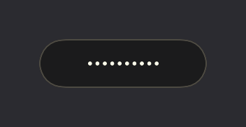
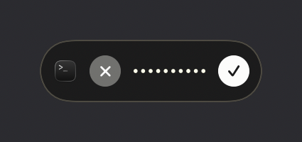
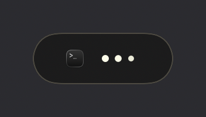
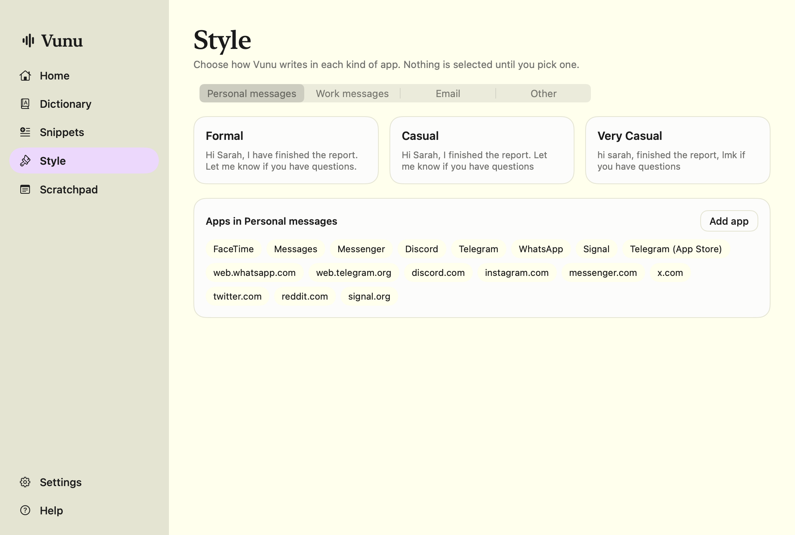
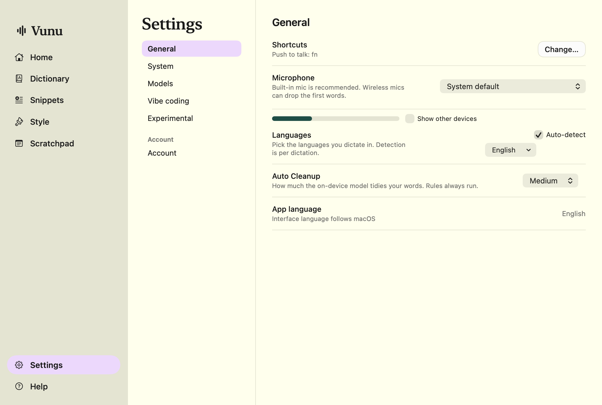
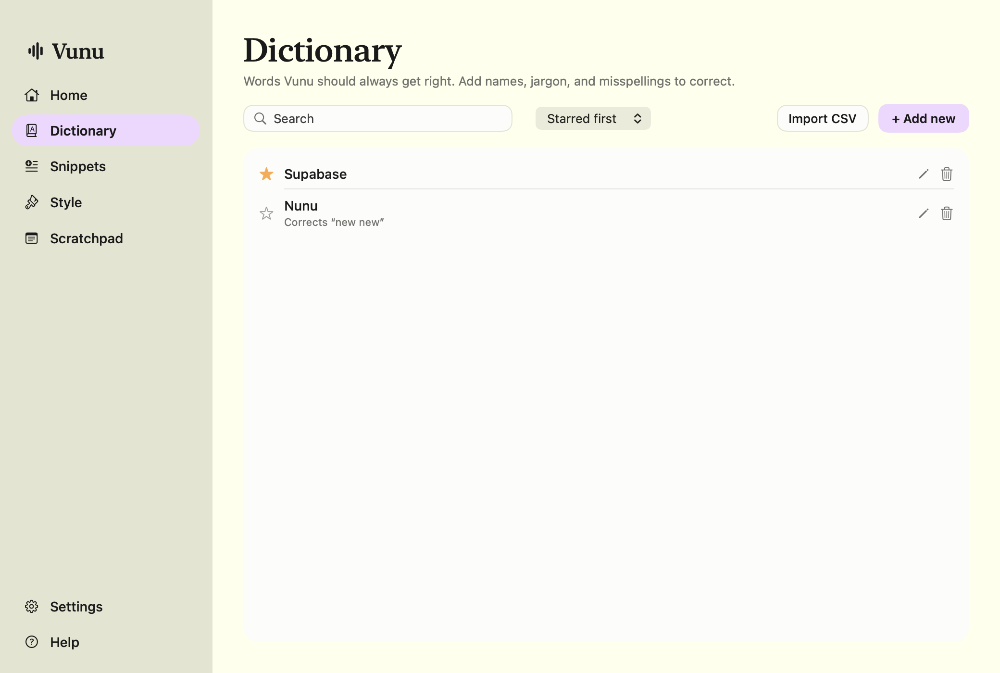
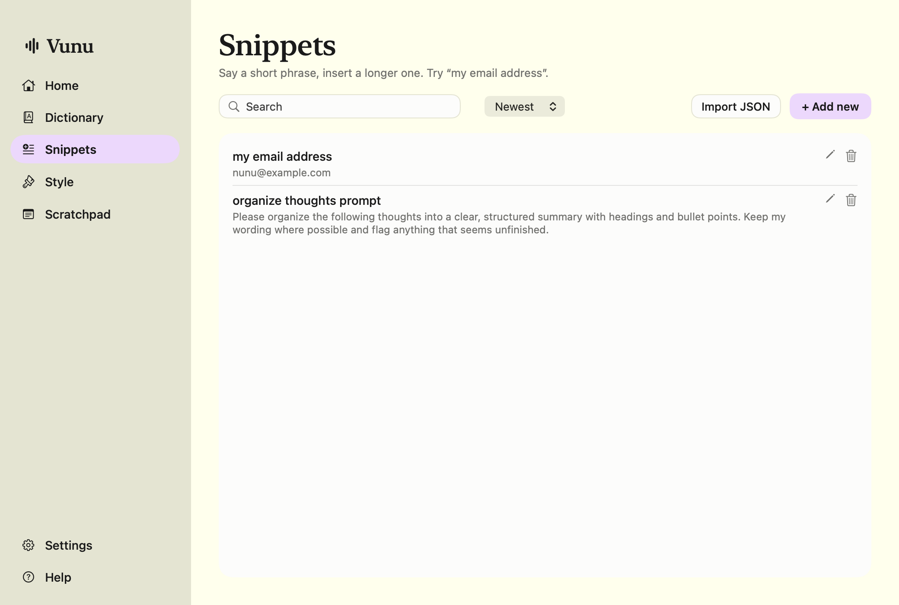

# Vunu

A native, local-only voice dictation app for macOS. Hold **fn**, talk, release, and the text lands in whatever you were typing in, cleaned up and formatted. No accounts, no cloud, no telemetry, no stored recordings: speech recognition and formatting run entirely on your Mac.

Built as a Wispr Flow-style tool in Swift/SwiftUI/AppKit. Requires **macOS 26** on Apple silicon.

<p align="center">
  
  
  
</p>
<p align="center"><em>The floating bar while idle, recording (showing the app that will receive the text), and processing.</em></p>

## Install

One line, on any Mac running macOS 26:

```sh
curl -fsSL https://raw.githubusercontent.com/NouranAlSharawneh/vunu/main/scripts/install.sh | zsh
```

That downloads the latest build from the [Releases page](https://github.com/NouranAlSharawneh/vunu/releases/latest), puts `Vunu.app` in `/Applications`, clears the quarantine flag (the app is signed with a personal certificate, not notarized), and opens it. If you'd rather download the zip from Releases yourself, run this once before opening it:

```sh
xattr -dr com.apple.quarantine /Applications/Vunu.app
```

On first launch, grant **Microphone** and **Accessibility** when asked. The speech model (~470 MB) downloads once into `~/Library/Application Support/Vunu/Models`.

## Use it

| Action | Default |
|---|---|
| Push to talk | hold `fn` |
| Hands-free | `fn`+`Space`, or double-tap `fn` (press again or ■ to stop) |
| Cancel | `Esc` |
| Paste / copy last transcript | `⌘⌃V` / `⌘⌃C` |
| Scratchpad | `⌥S` |
| Command Mode (edit selected text by voice) | hold `fn`+`⌃` (enable in Settings → Experimental) |

- Recording keeps going while you ⌘-Tab; the text is inserted wherever the cursor is when you release.
- Music never pauses or ducks.
- While recording, the menu bar icon and the floating bar show the icon of the app that will receive the text.
- Say "period", "comma", "new line", "at sign", "john at gmail dot com", "first… second… third…", "scratch that", "press enter".
- A built-in developer vocabulary fixes what the recognizer hears: "super pace" → Supabase, "cloud code" → Claude Code, "postgress" → Postgres, "key clock" → Keycloak, "direct us" → Directus, and a few hundred more. Add your own in Dictionary.
- All shortcuts are rebindable in Settings → General → Shortcuts.

## The app

| Style per app category | Settings |
|---|---|
|  |  |

| Dictionary | Snippets |
|---|---|
|  |  |

## What's inside

- **Speech to text:** NVIDIA Parakeet TDT 0.6B v3 via [FluidAudio](https://github.com/FluidInference/FluidAudio) (CoreML on the Neural Engine); Apple's on-device `SpeechAnalyzer` as an alternative engine.
- **Formatting:** a deterministic rules pass (spoken punctuation, numbers, emails/URLs, fillers, stutters, lists, self-corrections, developer vocabulary) plus an optional cleanup pass with Apple's on-device Foundation Models, guarded so it can only edit, never answer.
- **Insertion:** Accessibility fast path for native text views, clipboard paste with restore everywhere else, chunked paste for terminals.
- **Storage:** SQLite via GRDB for transcript history. Audio is not stored unless you turn it on in Settings → Account.

## Build from source

```sh
brew install xcodegen
git clone https://github.com/NouranAlSharawneh/vunu.git && cd vunu
scripts/build.sh          # xcodegen → xcodebuild → codesign → /Applications/Vunu.app
scripts/test.sh           # unit tests (swift test)
scripts/run.sh            # relaunch and tail ~/Library/Logs/Vunu/vunu.log
scripts/release.sh 0.1.0  # Release build → zip → GitHub release
```

Signing uses a certificate named **"Vunu Dev"** from your login keychain so Accessibility permission survives rebuilds. Create one with Keychain Access → Certificate Assistant → Create a Certificate (type: Code Signing), or change `CODE_SIGN_IDENTITY` in `project.yml`.

## Layout

```
App/                      thin app target (entry point, Info.plist, icon, fonts)
Packages/VunuCore/        all logic and UI as a Swift package
  Hotkeys/   Audio/   Speech/   Formatting/   Context/   Insertion/
  Session/   Persistence/   Models/   UI/FlowBar   UI/Hub   Design/
scripts/                  build, run, test, release, install, reset-tcc
docs/BUILD_PROMPT.md      the full product spec this was built from
```

Fonts: Figtree and EB Garamond (SIL Open Font License). Models are downloaded from Hugging Face on first run.
